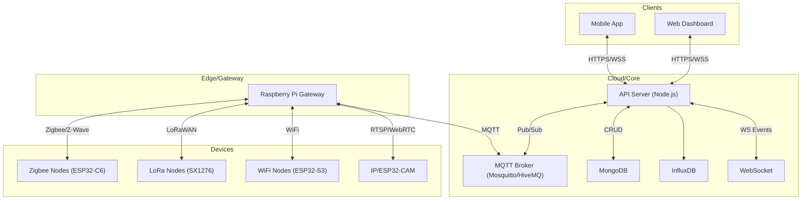
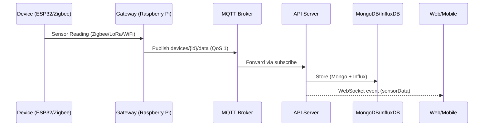
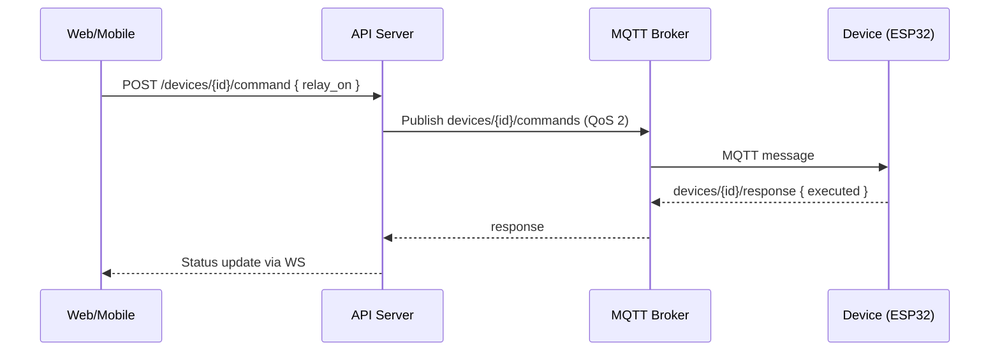
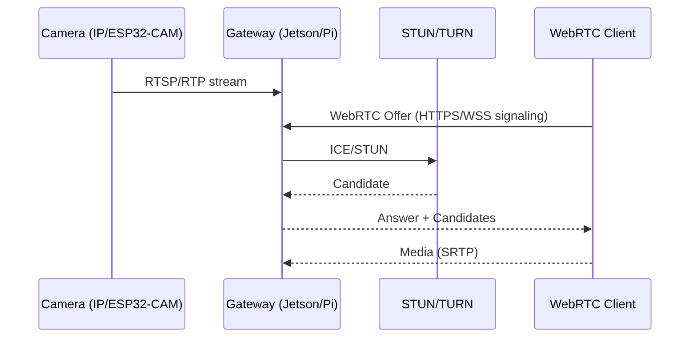
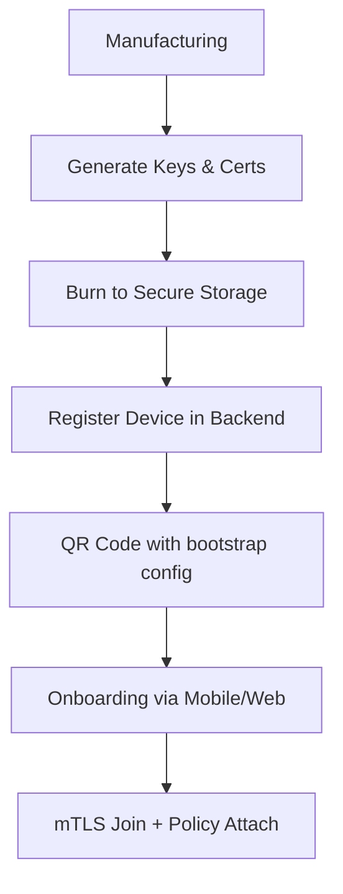
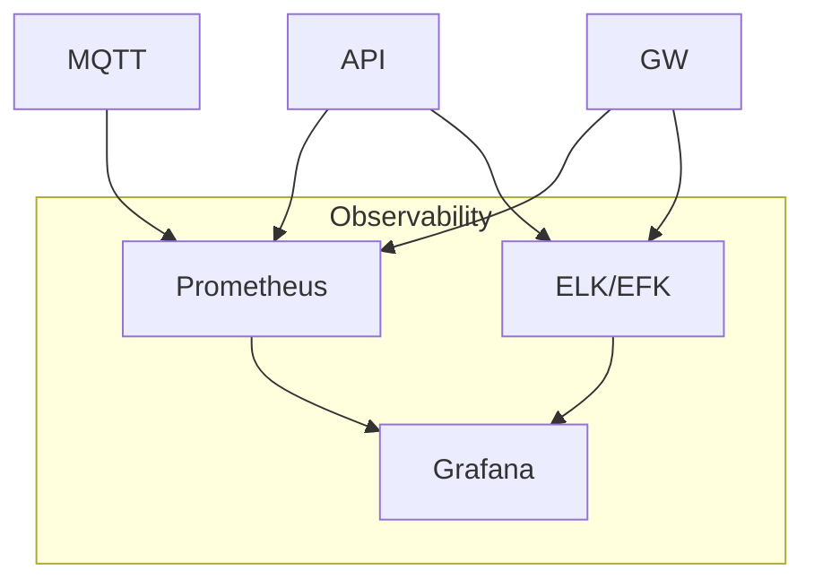

# 📘 IoT Smart System Blueprint

این داکیومنت یک نمای کامل، یکپارچه و تصویری از سیستم IoT شما ارائه می‌کند: معماری، دیاگرام‌ها، فلوهای داده، امنیت، مدل داده، پیاده‌سازی، تست و استقرار.

## فهرست مطالب
- معماری کلان و اجزاء
- توپولوژی شبکه و پروتکل‌ها
- فلوهای اصلی (Sequence)
- مدل‌های داده و Topicها
- امنیت و Provisioning
- الزامات عملکردی و مقیاس‌پذیری
- راهنمای پیاده‌سازی هر لایه
- مانیتورینگ، لاگینگ و تست

---

## معماری کلان سیستم



---

## توپولوژی شبکه و پروتکل‌ها

- هسته داده: MQTT/TLS برای داده سنسورها و فرمان‌ها
- ویدیو: WebRTC (کم‌تاخیر) یا RTSP→WebRTC Gateway
- سنسور تا برد: Zigbee 3.0 برای مصرف پایین و Mesh؛ LoRaWAN برای فواصل طولانی
- ارتباط محلی: WiFi/Ethernet برای گیت‌وی و دوربین‌ها
- API و Dashboard: HTTPS + WebSocket

```mermaid
graph LR
  subgraph WAN/Internet
  CLI1[Clients]-- HTTPS/WSS -->CDN[(CDN/Edge)]--->APIc[API]
  end

  subgraph Datacenter/Cloud
  APIc-- Pub/Sub -->MQTT[(MQTT Broker)]
  APIc-- CRUD -->DB[(MongoDB)]
  APIc-- Write -->TS[(InfluxDB)]
  APIc-- WS -->WSvc[(WS Service)]
  end

  subgraph Local Site
  GW[Gateway Pi]-- MQTT/TLS -->MQTT
  GW-- Zigbee -->ZB[Zigbee Mesh]
  GW-- LoRaWAN -->LR[LoRa Nodes]
  GW-- RTSP/WebRTC -->Cam[IP/ESP32-CAM]
```

---

## فلوهای اصلی (Sequence)

### ارسال داده سنسور


### اجرای فرمان


### استریم ویدیو


---

## مدل‌های داده، Topicها و قراردادها

- Topicها:
  - devices/{deviceId}/data
  - devices/{deviceId}/heartbeat
  - devices/{deviceId}/events
  - devices/{deviceId}/commands
  - devices/{deviceId}/response

نمونه Payload سنسورها:
```json
{
  "device_id": "ESP32-ABCD1234",
  "timestamp": 1712345678,
  "temperature": 24.6,
  "humidity": 58.2,
  "pressure": 1012.5,
  "light_level": 345.2,
  "sound_level": 12.3,
  "motion": false,
  "battery": 86,
  "rssi": -58,
  "free_heap": 197632
}
```

نمونه فرمان:
```json
{
  "command": "relay_on",
  "duration": 0,
  "source": "backend",
  "timestamp": 1712345700
}
```

پاسخ دستگاه:
```json
{
  "command": "relay_on",
  "status": "executed",
  "timestamp": 1712345701
}
```

---

## امنیت، Provisioning و مدیریت کلیدها

- Device Identity: X.509 per-device, Device ID + CSR هنگام تولید
- TLS 1.3 برای MQTT/HTTPS، اجبار به cipherهای مدرن
- احراز هویت: JWT برای کلاینت‌ها، username/password یا mTLS برای دستگاه‌ها
- Provisioning Flow:

- OTA امن: امضای فریمور و اعتبارسنجی قبل از فلش
- Least Privilege در MQTT: ACL بر اساس `devices/{id}/#`
- Network Segmentation: VLAN برای IoT، جدا از LAN کاربران

---

## الزامات عملکردی و SLOها

- تاخیر داده سنسور انتها به انتها: ≤ 200ms (LAN)، ≤ 500ms (WAN)
- دستورات کنترل: تحویل تضمین‌شده QoS 2 با ≤ 1s
- ویدیو: WebRTC با تاخیر ≤ 150ms، نرخ 720p@30fps (وابسته به شبکه)
- پایداری: Uptime 99.9%، MQTT HA (Replication/Cluster)
- مقیاس‌پذیری: 10k+ دستگاه، 10k msg/s با افقی‌سازی Broker/API

---

## راهنمای پیاده‌سازی لایه‌ها (Summary)

- Firmware (ESP32): PlatformIO، MQTT/TLS، OTA، سنسورهای I2C/SPI، Deep Sleep
- Gateway (Raspberry Pi): Bridge Zigbee/LoRa، Stream Transcoding، Local DB/Cache، Health
- Backend (Node.js): REST/WS، MQTT Consumer، Mongo/Influx، Auth، Alerts، Swagger
- Frontend (React): Real-time UI، نمودارها، کنترل دستگاه، اعلان‌ها، RTL
- Mobile (Expo/React Native): کنترل سریع، اعلان Push، QR Provisioning، Offline mode

ساختار موجود پروژه در `IoT_Smart_System/` پیاده‌سازی این لایه‌ها را فراهم کرده است.

---

## مانیتورینگ، لاگینگ و تست

- متریک‌ها: CPU/RAM، MQTT Throughput، API Latency، Device Online/Offline
- Logging مرکزی (ELK/EFK)
- تست‌ها: Unit/Integration/E2E/Performance/Security (اسکریپت‌ها در `docs/deployment/testing_guide.md`)



---

## لینک‌های مرجع داخل پروژه
- BOM کامل: `hardware/BOM_complete.csv`
- انتخاب قطعات: `docs/hardware_guide/component_selection.md`
- راهنمای تست: `docs/deployment/testing_guide.md`
- راهنمای استقرار: `docs/deployment/deployment_guide.md`
- Firmware نمونه: `hardware/esp32_firmware/`
- Gateway: `hardware/raspberry_pi/gateway_main.py`
- Backend: `backend/`
- Web Dashboard: `frontend/web_dashboard/`
- Mobile App: `frontend/mobile_app/`
